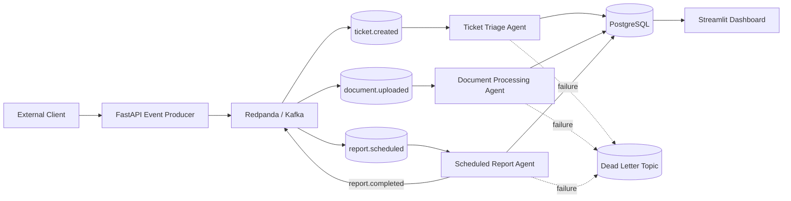

# Distributed Event-Driven Agent Platform

A production-style **event-driven multi-agent platform** where independent AI agents react to events through a Kafka-compatible message bus instead of being directly triggered by API requests.

The system is designed around:

```text
Producer → Redpanda/Kafka → Consumer Group → Agent → PostgreSQL
```

It supports **checkpointing, crash recovery, dead-letter handling, horizontal consumer scaling, structured logging, correlation IDs, monitoring, and load testing**.

> **Current status:** Core functionality is complete. Dockerization of the full stack is the remaining step before the project is fully containerized.

---

## Architecture



---

## Why This Project?

Most simple agent applications follow a request/response architecture:

```text
User
 ↓
API
 ↓
Agent
 ↓
Response
```

That approach becomes limiting when agents need to operate independently of a user's request.

A real operations platform may need to:

* Automatically triage a new support ticket
* Process a document immediately after upload
* Generate a scheduled report
* Continue long-running work after a restart
* Scale workers independently
* Retry failed events
* Isolate poison messages
* Track an event across multiple services

This project explores how to build that infrastructure using an **event-driven architecture**.

Instead of calling an agent directly:

```text
API → Agent
```

the system publishes an event:

```text
API → Event Bus → Agent
```

The producer does not need to know which agents consume the event.

---

## Core Features

* Event-driven architecture using Redpanda/Kafka
* Three independent event-driven agents
* Kafka producers and consumers
* Kafka consumer groups
* Horizontal worker scaling
* Persistent PostgreSQL checkpointing
* Crash recovery and resumability
* Dead-letter handling
* FastAPI event-producer API
* Scheduled event generation
* Streamlit monitoring dashboard
* Structured JSON logging
* Correlation IDs
* Consumer lag monitoring
* 500-event burst load testing
* Dockerization planned for final deployment

---

## Event-Driven Agents

### 1. Ticket Triage Agent

Listens to:

```text
ticket.created
```

When a new ticket is published, the Ticket Triage Agent consumes the event and runs the ticket routing/triage workflow.

```text
ticket.created
      ↓
Kafka
      ↓
Ticket Triage Consumer
      ↓
Triage Agent
      ↓
PostgreSQL
```

---

### 2. Document Processing Agent

Listens to:

```text
document.uploaded
```

The agent consumes document events and sends them through the document processing/ingestion pipeline.

```text
document.uploaded
        ↓
Kafka
        ↓
Document Consumer
        ↓
Document Processing Agent
        ↓
PostgreSQL
```

---

### 3. Scheduled Report Agent

Listens to:

```text
report.scheduled
```

The scheduled workflow triggers the report agent, which processes the request and publishes:

```text
report.completed
```

back to the event bus.

```text
Scheduled Trigger
       ↓
report.scheduled
       ↓
Kafka
       ↓
Report Agent
       ↓
report.completed
```

---

## Event Contract

All events follow a shared schema.

Example:

```json
{
  "event_id": "8f0c1c9e-...",
  "event_type": "ticket.created",
  "event_version": "1.0",
  "timestamp": "2026-08-15T12:00:00Z",
  "correlation_id": "b3a8c1...",
  "producer": "ticket-api",
  "payload": {
    "ticket_id": "123",
    "title": "Unable to access account"
  }
}
```

### Event Metadata

| Field            | Purpose                             |
| ---------------- | ----------------------------------- |
| `event_id`       | Unique identifier for the event     |
| `event_type`     | Type of event                       |
| `event_version`  | Event contract version              |
| `timestamp`      | Event creation time                 |
| `correlation_id` | Tracks one workflow across services |
| `producer`       | Service that created the event      |
| `payload`        | Event-specific data                 |

---

## Kafka Consumer Groups

Each agent type uses its own consumer group.

Example:

```text
ticket.created
      │
      ▼
ticket-triage-group
      │
      ├── worker-1
      ├── worker-2
      └── worker-3
```

Kafka distributes partitions between consumers in the same group.

This allows the system to scale horizontally:

```text
1 worker
   ↓
2 workers
   ↓
5 workers
   ↓
N workers
```

without changing the producer.

Adding more instances of the Ticket Triage Agent increases processing capacity while maintaining consumer-group semantics.

---

## Checkpointing & Crash Recovery

Long-running agents cannot depend entirely on in-memory state.

The platform persists processing state in PostgreSQL.

The basic lifecycle is:

```text
Receive Event
     ↓
Load Checkpoint
     ↓
Process Work
     ↓
Persist Progress
     ↓
Continue
```

If an agent crashes:

```text
Agent
  ↓
Crash
  ↓
Restart
  ↓
Load PostgreSQL State
  ↓
Resume From Last Checkpoint
```

This makes the agent **resumable instead of stateless**.

The goal is to ensure that a worker restart does not automatically mean losing all progress made on a long-running task.

---

## Dead-Letter Handling

Some events may repeatedly fail processing.

Instead of allowing those events to retry forever, the system sends repeatedly failing events to a dead-letter destination.

```text
                ┌─────────────┐
                │    Event    │
                └──────┬──────┘
                       ↓
                ┌─────────────┐
                │  Consumer   │
                └──────┬──────┘
                       ↓
                   Processing
                       │
              ┌────────┴────────┐
              │                 │
           Success            Failure
              │                 │
              ↓                 ↓
          Complete            Retry
                                │
                         ┌──────┴──────┐
                         │             │
                      Success       Repeated
                        │           Failure
                        ↓             │
                    Complete         ↓
                                  Dead Letter
```

This prevents a poison message from continuously disrupting normal event processing.

---

## Observability

The project uses structured JSON logging rather than relying only on plain `print()` statements.

Example:

```json
{
  "timestamp": "2026-08-15T12:00:00Z",
  "level": "INFO",
  "service": "ticket-consumer",
  "event": "ticket.created",
  "event_id": "abc-123",
  "correlation_id": "xyz-456",
  "message": "Ticket processed successfully"
}
```

The same `correlation_id` can be followed across:

```text
Producer
   ↓
Redpanda
   ↓
Consumer
   ↓
Agent
   ↓
PostgreSQL
```

This makes distributed debugging much easier.

---

## Monitoring Dashboard

A Streamlit dashboard provides visibility into the running platform.

The dashboard tracks:

* Event throughput
* Consumer lag
* Per-agent processing status
* Topic activity
* Event processing state

---

## Load Testing

The system was tested with a burst of:

```text
500 events
```

The load test was used to evaluate:

* Consumer throughput
* Processing latency
* Consumer lag
* Worker behavior under burst traffic
* Scaling behavior
* Event completion

The purpose was not simply to verify that one event works, but to observe how the event-driven system behaves under a sudden increase in workload.

---

## Technology Stack

| Layer            | Technology                         |
| ---------------- | ---------------------------------- |
| Language         | Python                             |
| Event Bus        | Redpanda / Kafka                   |
| API              | FastAPI                            |
| Database         | PostgreSQL                         |
| Scheduling       | Celery Beat                        |
| Dashboard        | Streamlit                          |
| Event Validation | Pydantic                           |
| Containers       | Docker / Docker Compose            |
| Messaging        | Kafka-compatible Producer/Consumer |
| Logging          | Structured JSON Logging            |

---

## Project Structure

```text
distributed-event-agent-platform/
│
├── src/
│   ├── agents/
│   │   ├── ticket_triage/
│   │   ├── document_processing/
│   │   └── scheduled_report/
│   │
│   ├── api/
│   ├── consumers/
│   ├── producers/
│   ├── events/
│   ├── checkpointing/
│   ├── database/
│   └── logging/
│
├── dashboard/
│   └── app.py
│
├── tests/
│
├── docker-compose.yml
├── requirements.txt
└── README.md
```

---

## Getting Started

### Prerequisites

Install:

* Python 3.10+
* PostgreSQL
* Redpanda or Kafka
* Docker Desktop

---

### 1. Clone the Repository

```bash
git clone <your-repository-url>

cd distributed-event-agent-platform
```

---

### 2. Create a Virtual Environment

```bash
python -m venv .venv
```

#### Windows

```bash
.venv\Scripts\activate
```

#### Linux/macOS

```bash
source .venv/bin/activate
```

---

### 3. Install Dependencies

```bash
pip install -r requirements.txt
```

---

### 4. Configure Environment Variables

Create a `.env` file:

```env
KAFKA_BOOTSTRAP_SERVERS=localhost:9092

POSTGRES_HOST=localhost
POSTGRES_PORT=5432
POSTGRES_DB=event_platform
POSTGRES_USER=postgres
POSTGRES_PASSWORD=postgres
```

Add any required AI/model API credentials used by the agents.

---

## Running the System

Start the infrastructure first:

```text
PostgreSQL
Redpanda
```

Then start the individual services/workers.

### FastAPI Producer

```bash
uvicorn <api_module>:app --reload
```

### Dashboard

```bash
streamlit run dashboard/app.py
```

### Agents

Start the Ticket Triage, Document Processing, and Scheduled Report consumers using their respective entry points.

---

## Producing an Event

The FastAPI service acts as a thin event producer.

For example:

```text
POST /tickets
```

can result in:

```text
ticket.created
```

being published to the event bus.

The API does not directly invoke the Ticket Triage Agent.

Instead:

```text
HTTP Request
     ↓
FastAPI
     ↓
ticket.created
     ↓
Redpanda
     ↓
Ticket Triage Consumer
     ↓
Agent
```

This separation is one of the central design principles of the project.

---

## Reliability Model

The platform is designed around **at-least-once processing**.

An important distinction is:

```text
Message delivery
       ≠
Successful business processing
```

The system therefore combines:

* Consumer groups
* Persistent checkpoints
* Retries
* Dead-letter handling
* Idempotent processing considerations
* Structured logs
* Correlation IDs
* PostgreSQL state

Exactly-once semantics are treated as a separate advanced concern rather than being assumed automatically.

---

## Failure Scenarios

### Worker Crash

```text
Processing
    ↓
Worker crashes
    ↓
Worker restarts
    ↓
Checkpoint loaded
    ↓
Processing resumes
```

### Repeated Event Failure

```text
Event
 ↓
Failure
 ↓
Retry
 ↓
Failure
 ↓
Retry
 ↓
Repeated Failure
 ↓
Dead Letter
```

### Traffic Spike

```text
500 events
     ↓
Kafka
     ↓
Partitions
     ↓
Multiple consumers
     ↓
Parallel processing
```

### Adding More Workers

```text
Before:

Consumer Group
      │
      └── Worker 1


After:

Consumer Group
      │
      ├── Worker 1
      ├── Worker 2
      └── Worker 3
```

The producer does not need to change.

---

## Engineering Principles

### Loose Coupling

Producers do not directly depend on agents.

```text
Producer → Event Contract → Event Bus → Consumer
```

Agents can therefore be added or removed independently.

### Persistence

Important agent progress is persisted instead of relying only on process memory.

### Failure Recovery

Failures are expected rather than treated as exceptional edge cases.

### Horizontal Scaling

Consumer groups allow multiple workers to process partitions concurrently.

### Observability

Events can be traced through the system using event IDs and correlation IDs.

---

## What This Project Demonstrates

This project demonstrates practical understanding of:

* Event-driven architecture
* Kafka producers and consumers
* Kafka consumer groups
* Partition-based scaling
* Long-running workers
* Agent checkpointing
* Crash recovery
* Dead-letter queues
* PostgreSQL state persistence
* Scheduled event generation
* FastAPI event production
* Structured logging
* Correlation IDs
* Consumer lag
* Throughput monitoring
* Load testing
* Distributed-system observability

---

## Key Lessons

The biggest lesson from this project was that the **happy path is the easy part**.

The difficult engineering questions are:

```text
What happens when the worker crashes?

What happens when an event repeatedly fails?

How does a long-running agent resume?

How do multiple consumers scale safely?

How do we know where an event is stuck?

How do we trace one event across multiple services?

How does the system behave during a traffic burst?
```

Building around these failure modes changed the project from a basic Kafka experiment into a more realistic distributed agent platform.

---

## Current Status

| Feature                   | Status       |
| ------------------------- | ------------ |
| Redpanda/Kafka Event Bus  | ✅ Complete   |
| Shared Event Schemas      | ✅ Complete   |
| Ticket Triage Agent       | ✅ Complete   |
| Document Processing Agent | ✅ Complete   |
| Scheduled Report Agent    | ✅ Complete   |
| Consumer Groups           | ✅ Complete   |
| PostgreSQL Checkpointing  | ✅ Complete   |
| Crash Recovery            | ✅ Complete   |
| Dead-Letter Handling      | ✅ Complete   |
| FastAPI Event Producer    | ✅ Complete   |
| Streamlit Dashboard       | ✅ Complete   |
| 500-Event Load Test       | ✅ Complete   |
| Structured Logging        | ✅ Complete   |
| Correlation IDs           | ✅ Complete   |
| Architecture Diagram      | ✅ Complete   |
| README                    | ✅ Complete   |
| Dockerization             | 🚧 Remaining |

---

## Roadmap

### v1

* [x] Event-driven architecture
* [x] Three independent agents
* [x] Kafka/Redpanda integration
* [x] Consumer groups
* [x] Checkpointing
* [x] Crash recovery
* [x] Dead-letter handling
* [x] FastAPI producer
* [x] Monitoring dashboard
* [x] Load testing
* [x] Structured logging
* [x] Correlation IDs
* [x] Architecture documentation
* [ ] Full Docker Compose deployment

### Future

* [ ] Idempotency layer
* [ ] Stronger retry/backoff policies
* [ ] Schema Registry
* [ ] Prometheus metrics
* [ ] Grafana dashboards
* [ ] Kubernetes deployment
* [ ] Cloud deployment
* [ ] Exactly-once business semantics
* [ ] Config-only agent registration
* [ ] Additional event-driven agents

---

## Resume Version

> Built a Kafka-based event-driven multi-agent platform with checkpointed, resumable long-running agents, dead-letter handling, horizontal consumer scaling, structured observability, and a Streamlit monitoring dashboard; load-tested with a 500-event burst.

---

## Project Goal

The goal of this project was to move from:

```text
"An API call triggers an agent"
```

to:

```text
"Agents continuously react to events."
```

The resulting architecture decouples event producers from agent workers and provides the infrastructure required for reliable, scalable, long-running AI agent workloads.
